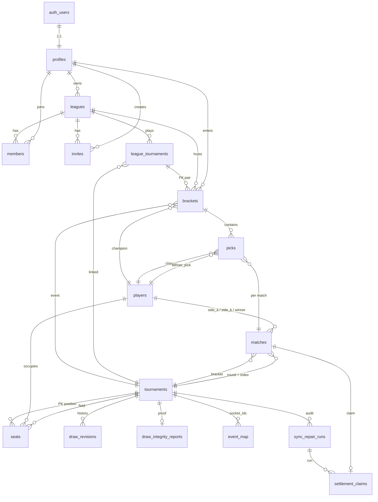

# Data model

Entity relationship for MatchRead Postgres. Schema lives in `supabase/migrations/0001`–`0020`.

Two domains share one database:

- **Facts** — tennis truth from the provider (world-readable, service-written).
- **Product** — leagues and picks (member-readable, RPC-written).

---

## Entity-relationship diagram



---

## Core entities

### Facts

| Table | Role | Key fields |
|-------|------|------------|
| `tournaments` | Calendar event + publish/lock | `slug`, `(tour, provider_id)`, `starts_on`, `main_draw_starts_on`, `draw_size`, `published_at`, `lock_at`, `tier`, `bracket_eligible`, `product_override` (`force_off` only) |
| `players` | Real people | `provider_id`, `last_name` (anti-fiction CHECKs) |
| `seats` | Official main-draw sheet | PK `(tournament_id, position)`; `kind` ∈ `player` \| `bye` \| `tbd` |
| `matches` | Topology + schedule + result | Unique `(tournament_id, round, index_in_round)`; `has_time`, `scheduled_at`, `winner_player_id`, `voided`, `settled_at` |
| `settlement_claims` | Idempotent settle boundary | PK `match_id`; `outcome` winner\|void; conflict unwinds parent advance |
| `draw_integrity_reports` | Publish proof | Must be `safe_to_publish` before official write (0017) |
| `draw_revisions` / `draw_replacements` | Draw hash history | Official field changes |
| `event_map` | Live socket ↔ match | Provider live event binding |
| `sync_repair_runs` / repairs | Ingest audit | Repair trail |

### Product

| Table | Role | Key fields |
|-------|------|------------|
| `profiles` | Display identity | 1:1 with `auth.users` |
| `leagues` | Group or solo | `format` single\|season, `is_solo`, `visibility` |
| `league_tournaments` | League ↔ event | Optional commissioner `locked_at` |
| `members` | Membership | `role` commissioner\|member |
| `invites` | Join tokens | `token`, `revoked_at` |
| `brackets` | One entry per user×league×event | `submitted_at`, `points`, `rank`, `champion_player_id` |
| `picks` | Chosen winner per match | PK `(bracket_id, match_id)` → `player_id` |

### Views / helpers

| Object | Role |
|--------|------|
| `public_calendar` | Eligible tournaments only — **public discovery surface** |
| `season_points` | Sum of bracket points for season leagues |
| `draw_is_official(id)` | `published_at` set + seat count = `draw_size` |
| `refresh_lock_at(id)` | `lock_at` = min timed R0 `scheduled_at` |
| `is_bracket_product(...)` | ATP/WTA 250+ policy (mirrored in `@matchread/core`) |

### Ops

| Table | Role |
|-------|------|
| `ops_events` | Telemetry / integrity alerts (founder dashboard) |

---

## Relationship notes

```text
auth.users ──1:1── profiles
                      │
                      ├── owns ──► leagues ◄── members ── profiles
                      │                │
                      │                ├── invites
                      │                └── league_tournaments ──► tournaments
                      │                          │
                      │                          └── brackets ──► picks ──► matches
                      │                                │              │
                      │                                └──► players   └──► players

tournaments ──*── seats ──?── players   (kind player|bye|tbd)
            ──*── matches ──?── players (sides / winner)
            ──*── settlement_claims (via matches)
```

---

## Invariants (encoded in schema / RPCs)

1. **Official draw** — seat count equals `draw_size` and `published_at` is set (`draw_is_official`).
2. **Seat kinds** — every seat is named player, official bye, or official TBD label. No fictional last names.
3. **Lock** — platform lock from timed R0 only; commissioner may lock a league event early.
4. **Picks gate** — `save_picks` / `submit_bracket` refuse when locked + official.
5. **Eligibility** — public list via `public_calendar`; override can only **force_off**, never promote.
6. **Settlement claims** — one claim per match; replace path unwinds parent side before re-advance.
7. **Single-format leagues** — at most one tournament row (`enforce_single_league_tournament`).

---

## Migration map (themes)

| Migration | Theme |
|-----------|--------|
| 0001 | Profiles |
| 0002 | Tournaments, players, seats |
| 0003 | Matches + `refresh_lock_at` |
| 0004 | Leagues, members, invites |
| 0005 | Brackets, picks, season_points |
| 0006 | RLS + product RPCs |
| 0007–0009 | Cron → Edge |
| 0010–0011 | Calendar identity / solo naming |
| 0012 | Draw revisions, event_map |
| 0013 | Trust boundary, ops_events, tier |
| 0014 | `main_draw_starts_on` |
| 0015 | Settlement claims |
| 0016 | Eligibility + `public_calendar` |
| 0017 | Lock write / publish integrity proof |

Archive SQL under `supabase/migrations/archive/` is historical, not the live chain.
